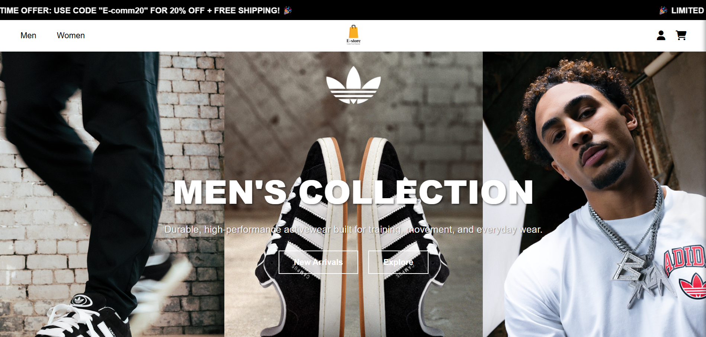
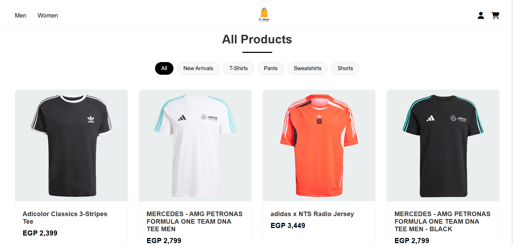
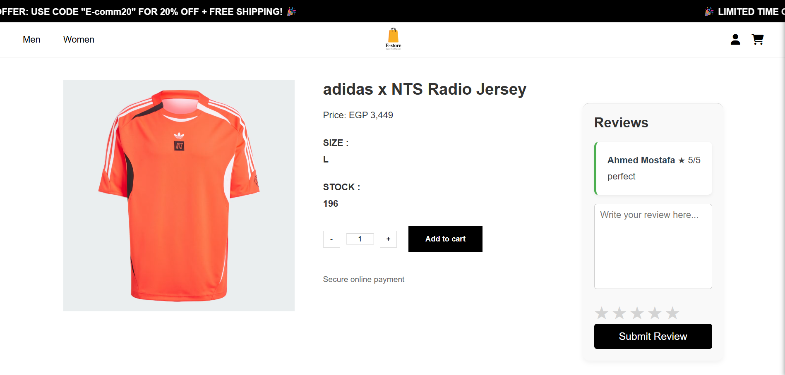
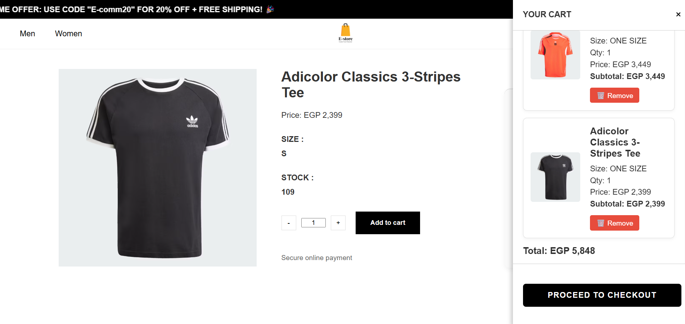
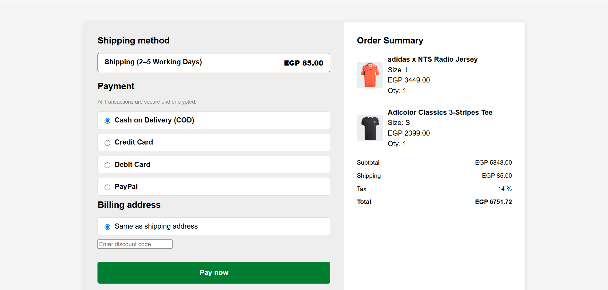
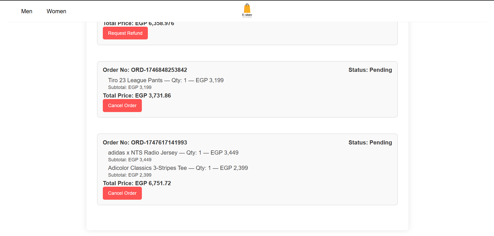
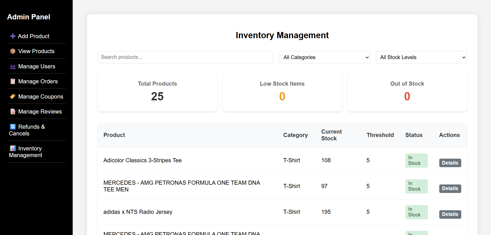

# 🛒 E-Commerce-NodeJS

A modern, full-stack e-commerce web application built with **Node.js**, **Express**, **MongoDB**, and a responsive HTML/CSS/JS frontend.

---

## 🚀 Features

- **User Registration & Login** (JWT-based authentication)
- **Product Catalog** with filtering by gender, category, and type
- **Product Details** with reviews and ratings
- **Shopping Cart** (add, remove, update quantity)
- **Checkout** with multiple payment options (COD, Card, PayPal)
- **Order History** for users
- **Refund & Cancel Requests**
- **Admin Dashboard**:
  - Manage products, users, orders, coupons, reviews, inventory, and refunds
- **Responsive Frontend** (HTML, CSS, JS)
- **RESTful API** (Express, MongoDB/Mongoose)

---

## 📁 Project Structure

```
.
├── backend/
│   ├── public/
│   └── src/
├── frontend/
│   ├── CSS_files/
│   ├── Html_files/
│   ├── Images/
│   └── JS_files/
├── Testing/
├── .env
├── package.json
└── README.md
```

---

## 🛠️ Getting Started

### Prerequisites

- [Node.js](https://nodejs.org/) (v22.15.0 recommended)
- [MongoDB](https://www.mongodb.com/)

### Installation

1. **Clone the repository**
   ```bash
   git clone <repository-url>
   cd E-Commerce-NodeJS
   ```

2. **Install dependencies**
   ```bash
   npm install
   ```

3. **Configure environment variables**

   Create a `.env` file in the root directory. Example:
   ```
   MONGO_URI=mongodb://localhost:27017/ecommerce
   JWT_SECRET=your_jwt_secret
   PORT=8000
   ```

4. **Start the server**
   ```bash
   npm run dev
   ```
   The backend will run on [http://localhost:8000/](http://localhost:8000/).

5. **Access the app**

   - **Frontend:** Visit [`http://localhost:8000/home`](http://localhost:8000/home).
   - **Admin Panel:** Visit [`http://localhost:8000/admin`](http://localhost:8000/admin).

---

## 📚 API Endpoints

- **User Auth:** `/auth/register`, `/auth/login`
- **Products:** `/api/products`
- **Cart:** `/api/cart`
- **Orders:** `/api/orders`
- **Users:** `/api/users`
- **Coupons:** `/api/coupons`
- **Refunds:** `/api/refunds`
- **Admin:** `/admin`

See [Testing/user.rest](Testing/user.rest) and [Testing/admin.rest](Testing/admin.rest) for example requests.

---

## 📸 Screenshots

<table>
  <tr>
    <td><b>Home Page</b><br></td>
    <td><b>Product Catalog</b><br></td>
  </tr>
  <tr>
    <td><b>Product Details</b><br></td>
    <td><b>Cart Sidebar</b><br></td>
  </tr>
  <tr>
    <td><b>Checkout Page</b><br></td>
    <td><b>Order History</b><br></td>
  </tr>
  <tr>
    <td><b>Admin Dashboard</b><br></td>
  </tr>
</table>

## 📜 Scripts

- `npm run dev` — Start the server in development mode
- `npm install` — Install dependencies

---

### **Made with ❤️ for learning and real-world e-commerce projects.**